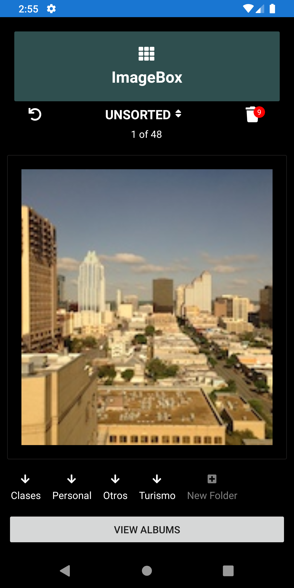
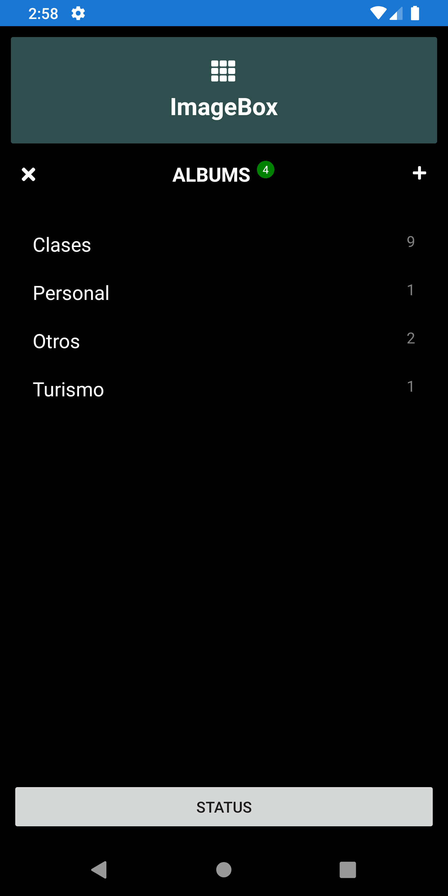
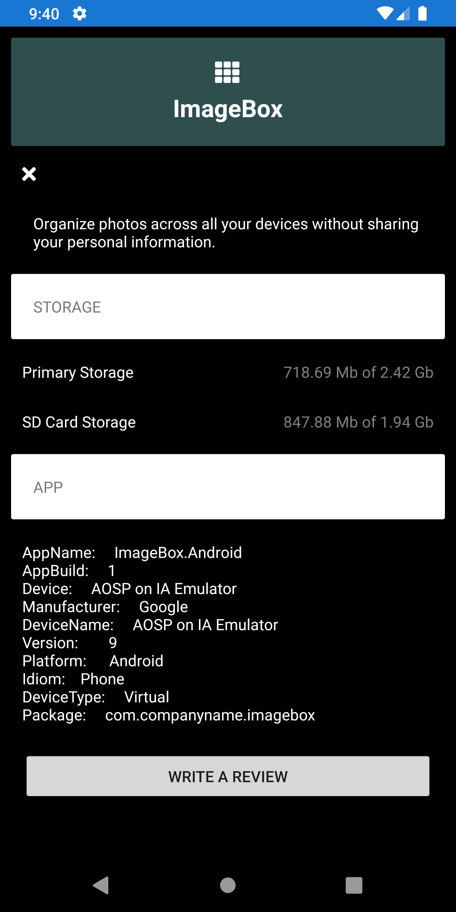

# ImageBox
Organize your photos without sharing personal information.

**ImageBox** is a photo organizer application to sort your photo in personal folders quickly without sharing your personal information with any entity. 

## Original Requirement: 

* ### Get all Photos unsorted.
Get all photos unsorted in the main page of the application.
* ### Send photo to trash.
Send photos to trash only swiping up the photo.
* ### Organize the photos
Organize the photos storing in your personal folders only clicking over the folder name.
* ### View Photos in folder
View all photos in the folder organized in the previous process.

## Concept Layout.
Please, check the concept layout of the aplication, the main idea is to organize the photo in personal folders created under the Picture directory of your Android phone. Also, you can move photo to trash under deleted from the phone.
<table>
  <tr>
    <td>
      
    </td>
    <td>
      
      </td>
      <td>
        
      </td>
    <td>
      
    </td>
    <td>
      
      </td>
  </tr>
  </table>
